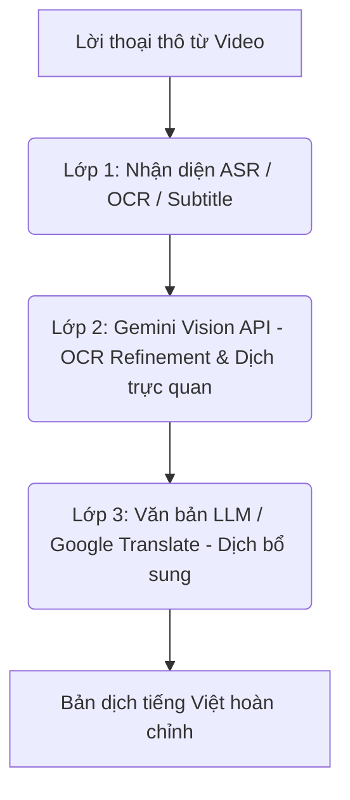

# Kiến Trúc Dịch Thuật & Lồng Tiếng VoiceAI

Tài liệu này giải thích chi tiết kiến trúc xử lý dịch thuật, đồng bộ giọng nói và cơ chế gán giọng đọc thuyết minh của VoiceAI để các nhà phát triển sau này có thể dễ dàng bảo trì và mở rộng dự án.

---

## 🏗️ 1. Quy Trình Xử Lý Dịch Thuật 3 Lớp (3-Layer Pipeline)

Hệ thống lồng tiếng VoiceAI phân tách quá trình thu thập, sửa lỗi và dịch thuật lời thoại thành **3 lớp độc lập** để tối ưu hóa chất lượng bản dịch:



- **Lớp 1 (ASR/OCR/Softsub)**: Lấy lời thoại thô từ video thông qua nhận diện giọng nói (Whisper), tải phụ đề có sẵn (YouTube Softsub) hoặc quét phụ đề cứng trên màn hình (Video OCR bằng EasyOCR).
- **Lớp 2 (Gemini Vision API - Sửa lỗi & Dịch)**: Nếu sử dụng OCR, hệ thống gửi ảnh chụp phụ đề cứng kèm theo text thô lên Gemini Vision. Gemini Vision vừa đóng vai trò sửa lỗi chính tả cho EasyOCR, vừa dịch trực tiếp sang tiếng Việt dựa trên việc quan sát hình ảnh thực tế của video (đạt chất lượng tốt nhất).
- **Lớp 3 (Dịch bổ sung)**: Các câu thoại mà Gemini Vision chưa xử lý (hoặc bị lỗi một phần) sẽ được gửi đi dịch bổ sung bằng LLM thuần văn bản (hoặc Google Translate) ở hàm `translate_segments`.

---

## ⚡ 2. Các Cơ Chế Cải Tiến Cốt Lõi

### 2.1. Cơ Chế Chịu Lỗi Lớp 2 (Fault-Tolerant Index Mapping)
- **Tập tin liên quan**: `_refine_with_gemini_vision` trong [dubbing_engine.py](file:///d:/Voice_AI/app/services/dubbing_engine.py).
- **Nguyên lý hoạt động**: Khi gửi lô 10 ảnh lên Gemini Vision, prompt yêu cầu trả về mảng JSON chứa trường `"index"` (từ `0` đến `9`). Sau đó, code tạo một dictionary map dựa trên trường `"index"` để cập nhật trực tiếp vào segment tương ứng. 
- **Lợi ích**: Nếu Gemini Vision bỏ sót hoặc gộp một số ảnh (ví dụ chỉ trả về 8/10 câu), hệ thống vẫn giữ lại và áp dụng được 8 bản dịch tốt, thay vì huỷ bỏ cả batch 10 câu như trước đây.

### 2.2. Cơ Chế Bảo Toàn Bản Dịch Chất Lượng Cao (Translation Preservation)
- **Tập tin liên quan**: `translate_segments` trong [dubbing_engine.py](file:///d:/Voice_AI/app/services/dubbing_engine.py).
- **Nguyên lý hoạt động**: Ở Lớp 3, trước khi gọi LLM dịch, hệ thống lọc ra danh sách các segment chưa có bản dịch bằng:
  ```python
  pending_items = [(idx, seg) for idx, seg in enumerate(segments) if not seg.get("translation")]
  ```
  Hệ thống chỉ chia batch và dịch bổ sung cho các segment trong danh sách `pending_items` này.
- **Giữ ngữ cảnh**: Để LLM dịch chuẩn, khi build prompt cho từng segment cần dịch, hệ thống sử dụng `global_idx` của nó để tham chiếu ngược về mảng gốc và lấy câu liền trước (`prev_text = segments[global_idx - 1].get("text")`) làm ngữ cảnh dẫn chuyện.
- **Lợi ích**: Bảo toàn hoàn toàn các câu thoại đã được Gemini Vision dịch cực kỳ chuẩn xác trước đó, tránh việc bị LLM văn bản ghi đè lên làm giảm chất lượng. Đồng thời tiết kiệm từ 40% - 70% token API.

### 2.3. Cơ Chế Giọng Thuyết Minh Đơn Lẻ (Single Voice Override)
- **Tập tin liên quan**: `run_dubbing_pipeline` (Bước 14) trong [dubbing_tasks.py](file:///d:/Voice_AI/app/workers/dubbing_tasks.py).
- **Nguyên lý hoạt động**:
  - Khi người dùng cấu hình một giọng cụ thể (ví dụ: `voice_profile != "auto"`, như chọn một giọng đọc nữ miền Nam cố định): Hệ thống gán duy nhất giọng đọc này cho toàn bộ các Speaker được phát hiện (`Speaker 1`, `Speaker 2`,...) trong tệp `voice_map`.
  - Khi người dùng chọn `"auto"`: Hệ thống tự động phân vai bằng cách thay đổi xen kẽ giọng đọc nam/nữ cho các Speaker để lồng tiếng sống động hơn.
- **Lợi ích**: Đảm bảo video thành phẩm chỉ sử dụng đúng giọng thuyết minh duy nhất mà người dùng đã chủ động chọn, không bị tự ý đổi giọng giữa chừng.

### 2.4. Cơ Chế Đồng Bộ Giọng Nói (Sync & Time-stretching)
- **Tập tin liên quan**: `generate_ssml_for_segment` và `merge_tts_with_video` trong [dubbing_engine.py](file:///d:/Voice_AI/app/services/dubbing_engine.py).
- **Nguyên lý hoạt động**: 
  1. **TTS Rate**: Tính toán tốc độ nói dựa trên số từ và thời lượng gốc. Nếu câu dịch dài hơn tốc độ nói tự nhiên (2.8 từ/giây), cấu hình tăng tốc Edge-TTS (tối đa $+60\%$).
  2. **Atempo Co-stretching**: Nếu tệp âm thanh thực tế sinh ra vẫn dài hơn thời lượng video cho phép, sử dụng bộ lọc `atempo` của FFmpeg để tăng tốc độ nói (tối đa $1.4\times$ để tránh méo tiếng).
  3. **Truncate-to-fit**: Nếu câu thoại vẫn quá dài sau khi tăng tốc, áp dụng cắt âm thanh cứng và **fade-out 100ms** để đảm bảo câu thoại tiếp theo bắt đầu đúng thời điểm phát gốc trên video, không bị lệch nhịp.
